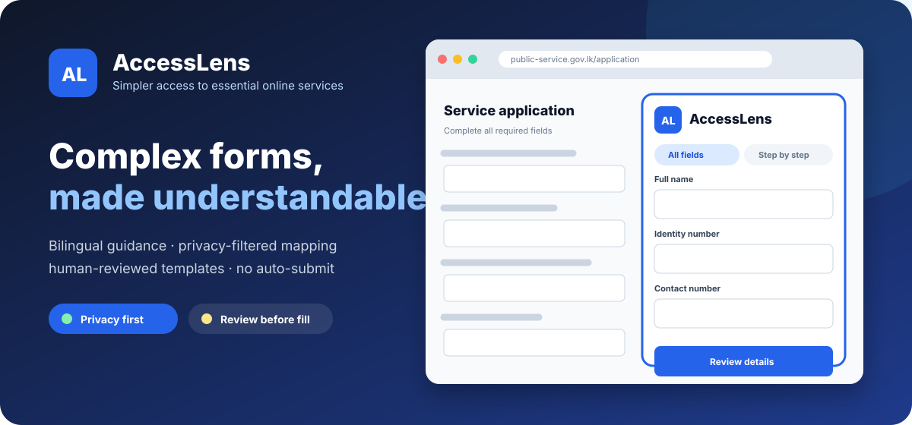
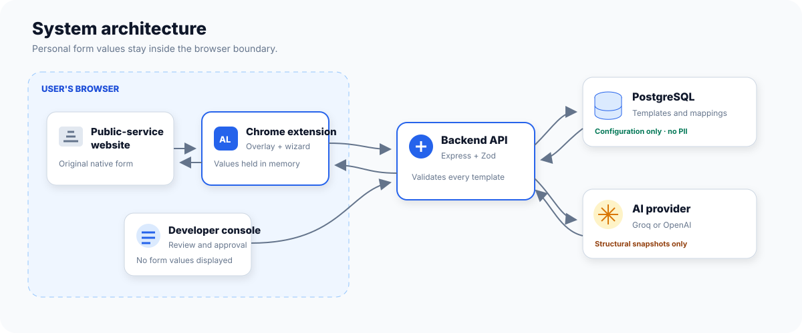
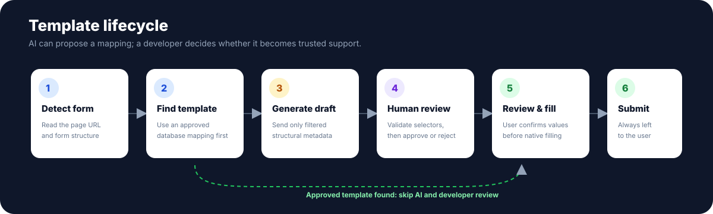

# AccessLens

<p align="center">
  
</p>

<p align="center">
  A privacy-first Chrome extension that turns complex public-service forms into a simpler, bilingual, review-before-fill experience.
</p>

## The Problem It Solves

In Sri Lanka specially Government websites for services like passport renewal, business registration, and tax filing can be hard to use. Many people use YouTube videos, blogs, or online forums to understand what to do. This creates several problems:


## This creates several problems:

Tutorials can become outdated when the website layout, field names, or requirements change.
Videos and blogs cannot understand the exact problem a user is facing.
Switching between the government website and a tutorial can cause confusion, mistakes, and session timeouts.

## What AccessLens Does

AccessLens finds supported forms, such as forms on `gov.lk`, and shows them in a simpler interface in both English and Sinhala. It gives help directly on the website, so users do not need separate tutorials.

### Core Features

- **Guidance on the Website:** Gives step-by-step instructions while the user is filling out the form.
- **Correct Step Order:** Makes sure users complete each page in the correct order. If a step is skipped, it shows a message and guides the user back.
- **Smart AI Help:** Includes an AI assistant that understands the user’s current step and the full application process. This helps it give accurate and useful answers.
- **Different Display Options:** Lets users see all fields at once or complete the form one step at a time. It supports English and Sinhala and can appear on the same page or in a separate window.
- **Protects User Privacy:** Adds the user’s information to the original form only after the user confirms it. It does not submit the form automatically.
- **Tools for Developers:** Uses approved PostgreSQL templates to reduce unnecessary AI use. For forms it does not know, it creates a privacy-safe draft and sends it to a developer dashboard for checking, editing, and approval.

> [!IMPORTANT]
> AccessLens is a prototype. The developer API currently has a placeholder authentication guard and must not be exposed publicly without real authentication and authorization.

## How it works

<p align="center">
  
</p>

The extension sends the backend only structural form metadata such as labels, types, required flags, options, and selectors. Personal values entered by the user remain in browser memory and are not sent to the API or stored in PostgreSQL.

<p align="center">
  
</p>
AccessLens operates through a secure, three-tier architecture comprising a Chrome Extension (Content Script), a Node.js/Express API, and a PostgreSQL database. The core philosophy of the system is **structural mapping without remote data transmission**.

### 1. Form Detection & Metadata Extraction
When a user navigates to a web page, the extension's `contentScript.ts` scans the DOM. It extracts only the **structural metadata** of the form—such as input types, labels, required flags, ARIA attributes, and CSS selectors. It strictly ignores and isolates any personal values entered by the user.

### 2. Template & Workflow Resolution
The extension sends the page URL and normalized headings to the backend API via endpoints like `/api/templates/resolve` and `/api/instructions/resolve`. 
* **If a match exists:** The PostgreSQL database returns an approved field-mapping template and the associated multi-step workflow instructions.
* **If no match exists:** The extension gracefully falls back, offering the user the option to submit a website support request.

### 3. Secure UI Injection & Workflow Tracking
Once a template is resolved, the extension renders a simplified React-based overlay or wizard using Shadow DOM to prevent CSS leakage or conflicts with the host government page.
* **State Management:** It uses encrypted browser local storage (`WorkflowProgress`) to track completed steps, preventing out-of-order execution.
* **Filling, Not Submitting:** When the user completes the simplified UI, the extension maps their local inputs to the original form's CSS selectors and dispatches native browser events. The final submission action is intentionally left to the user.

### 4. Path-Aware AI Context
When a user requests AI assistance for a confusing step, the extension does not send their form data. Instead, it calls `/api/instructions/:instructionId/ai-support`. The backend queries the database for the *entire* instruction pathway (Step 1 to N) and passes this structural context to the LLM (via Groq or OpenAI). This allows the AI to provide step-specific guidance without ever exposing personal data.

### 5. The Developer Loop (Draft Generation & Approval)
To support new government portals safely, AccessLens uses a human-in-the-loop developer console:
1. The backend securely strips all potential PII from a requested site's structural snapshot.
2. It sends this sanitized structure to the AI provider to generate a draft mapping.
3. The draft is saved in PostgreSQL with a `pending_review` status.
4. A developer uses the local React console to manually edit, validate, and approve the mapping via the `/api/developer/templates` endpoints before it becomes active for end users.

---
## Tech stack

| Layer | Technology |
| --- | --- |
| Browser extension | Chrome Manifest V3, React, TypeScript, Vite, Shadow DOM |
| Backend API | Node.js, Express, TypeScript, Zod |
| Database | PostgreSQL with `pgcrypto` and row-level security enabled |
| AI template generation | Groq or OpenAI through the OpenAI-compatible SDK |

## Prerequisites

- Node.js 20 or newer
- npm
- PostgreSQL
- Google Chrome or another Chromium browser that can load unpacked extensions
- A Groq or OpenAI API key only if you want automatic draft generation

## Local setup

### 1. Install dependencies

```bash
npm install
cd backend
npm install
cd ..
```

### 2. Create and seed the database

Create a PostgreSQL database and run the files in this order:

```bash
psql -d accesslens -f database/schema.sql
psql -d accesslens -f database/seed.sql
```

The seed adds an approved template for the [Selenium web form](https://www.selenium.dev/selenium/web/web-form.html).

### 3. Configure the backend

Copy `backend/.env.example` to `backend/.env`, then update the database credentials.

```dotenv
PORT=4000
FRONTEND_ORIGIN=http://localhost:5173,chrome-extension://your-extension-id

DB_HOST=localhost
DB_PORT=5432
DB_NAME=accesslens
DB_USER=accesslens_user
DB_PASSWORD=replace_me
DB_SSL=false

AI_PROVIDER=groq
GROQ_API_KEY=replace_with_your_groq_secret_key
GROQ_BASE_URL=https://api.groq.com/openai/v1
AI_MODEL=openai/gpt-oss-20b
```

To use OpenAI instead, set `AI_PROVIDER=openai`, `OPENAI_API_KEY`, and a supported `AI_MODEL`. Use `DB_SSL=true` when required by your database provider. Never commit `backend/.env`.

### 4. Start the API

```bash
cd backend
npm run dev
```

Verify the database connection at <http://localhost:4000/api/health>.

### 5. Run the developer console

In a second terminal:

```bash
npm run dev
```

Open <http://localhost:5173>. The console displays generated templates awaiting review and provides editors for mappings and runner instructions.

### 6. Build and load the extension

```bash
npm run build
```

Then:

1. Open `chrome://extensions`.
2. Enable **Developer mode**.
3. Choose **Load unpacked**.
4. Select this project's `dist` directory.
5. If needed, copy the installed extension ID into `FRONTEND_ORIGIN`, restart the API, and reload the extension.

## Testing the end-to-end flow

1. Keep the backend running.
2. Open the [Selenium web form](https://www.selenium.dev/selenium/web/web-form.html).
3. Complete the simplified AccessLens form in the page overlay.
4. Review the values and choose **Confirm and Fill Original Form**.
5. Confirm that the native fields are filled but the form is not submitted.
6. Open a supported `gov.lk` page with an unmapped form to exercise AI draft generation.
7. Review the new draft at <http://localhost:5173> before approving it.

After frontend or extension changes, run `npm run build`, reload the extension from `chrome://extensions`, and refresh the target page.

## Available scripts

| Location | Command | Purpose |
| --- | --- | --- |
| Project root | `npm run dev` | Start the Vite developer console |
| Project root | `npm run build` | Type-check and build the extension into `dist` |
| Project root | `npm run preview` | Preview the production frontend build |
| `backend/` | `npm run dev` | Run the API with file watching |
| `backend/` | `npm run build` | Compile the API to `backend/dist` |
| `backend/` | `npm start` | Run the compiled API |

## API overview

| Method | Endpoint | Purpose |
| --- | --- | --- |
| `GET` | `/api/health` | Check API and database health |
| `GET` | `/api/templates` | List approved templates |
| `GET` | `/api/templates/match?url=...` | Legacy URL-only approved-template match |
| `GET` | `/api/templates/resolve?url=...&heading=...` | Resolve exactly one approved template by URL and normalized H1 |
| `GET` | `/api/instructions/resolve?url=...&heading=...` | Resolve user-facing workflow guidance by URL and normalized H1 |
| `GET` | `/api/instructions/guides?url=...` | List the latest completed recorded guide for each category on a website |
| `GET` | `/api/instructions/guides/:sessionId` | Return the ordered steps for a completed recorded guide |
| `GET` | `/api/instructions/workflows/:workflowKey/first` | Return the first active workflow instruction |
| `POST` | `/api/instructions/:instructionId/ai-support` | Return a short AI simplification of an active instruction |
| `POST` | `/api/developer/website-requests/:id/generate-template` | Generate a pending draft for a requested website |
| `GET` | `/api/developer/stats` | Read developer-console counts |
| `GET` | `/api/developer/templates/pending` | List pending drafts |
| `PATCH` | `/api/developer/templates/:id` | Update a draft and its field mappings |
| `POST` | `/api/developer/templates/:id/validate` | Validate a draft |
| `POST` | `/api/developer/templates/:id/approve` | Approve a draft |
| `POST` | `/api/developer/templates/:id/reject` | Archive a rejected draft |

## Privacy and safety model

AccessLens is designed around three enforced template policies:

```ts
{
  storePersonalData: false,
  autoSubmit: false,
  manualReviewRequired: true
}
```

The database stores site configuration, template versions, field mappings, validation rules, runner instructions, and anonymous template errors. It must not store names, identity numbers, phone numbers, passwords, OTPs, payment details, or completed form values.

AI requests contain a page URL, title, language, and a filtered structural snapshot. Current input values are excluded. Generated selectors are checked against selectors observed in that snapshot, and new templates are saved as `pending_review` rather than automatically approved.

## Project structure

```text
AccessLens/
├── backend/              Express API, validation, and AI/template services
├── database/             PostgreSQL schema and demo seed
├── docs/                 Architecture notes and README artwork
├── public/               Chrome manifest and local test form
├── src/
│   ├── background/       Extension service worker
│   ├── content/          Page overlay, form discovery, and native filling
│   ├── api/              Frontend API clients
│   ├── components/       React UI components
│   ├── App.tsx           Developer console
│   └── separateWindow.ts Separate simplified-form window
└── vite.config.ts        Multi-entry extension build
```

For a deeper explanation of component boundaries and data handling, see [the architecture notes](docs/frontend-backend-database.md) and [the multi-step workflow guidance documentation](docs/workflows-and-guidance.md).

## Production checklist

- Add authentication and role-based authorization to `/api/developer/*`.
- Restrict CORS to the deployed console and extension origins.
- Put the API behind TLS and add durable rate limiting.
- Use a least-privilege database role and managed secrets.
- Add automated unit, API, and browser-extension tests.
- Complete accessibility and bilingual-content reviews.
- Define retention and monitoring policies for anonymous errors.

