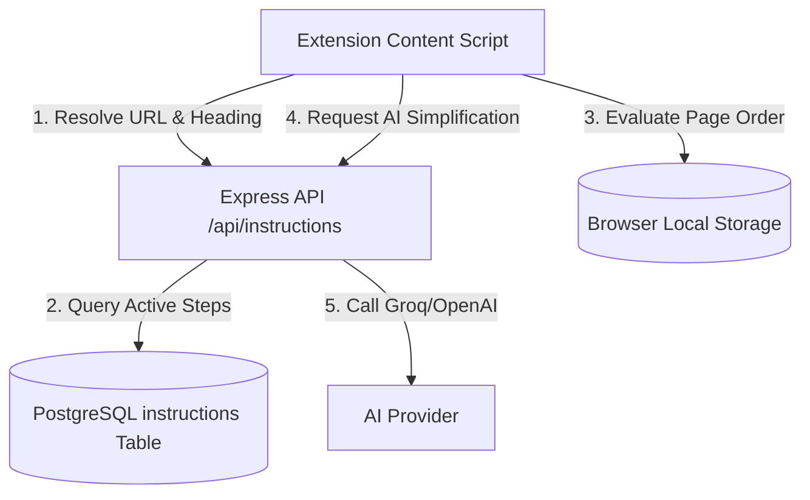

# AccessLens Multi-Step Workflows & Guided Instructions

AccessLens supports user-facing, multi-step workflow guidance. This system coordinates multi-page workflows for complex public services (such as passport applications or business registration processes), enforces step ordering, and provides localized AI simplification for complex instruction text.

---

## Architecture Overview



---

## 1. Database Schema

The database maintains a dedicated `instructions` table separate from the technical form-filling `runner_instructions`.

```sql
create table if not exists instructions (
  id uuid primary key default gen_random_uuid(),
  site_id uuid not null references sites(id) on delete cascade,
  template_id uuid references templates(id) on delete set null,
  workflow_key text not null,               -- Identifies the specific multi-page workflow
  page_key text not null,                   -- Unique key for the page/step (e.g. 'personal-details')
  step_order integer not null check (step_order > 0),
  page_url text not null,                   -- Canonical landing URL
  url_pattern text not null,                -- Pattern matching (supports wildcards e.g. % or *)
  heading_match text not null,              -- Normalized H1 heading text to match on-page
  instruction_title text not null,          -- User-friendly title
  instruction_text text not null,           -- Core instructions/guidelines
  completion_rule jsonb not null default '{}'::jsonb,
  allowed_next_page_keys text[] not null default '{}',
  out_of_order_message text not null,       -- Message displayed if visited prematurely
  block_out_of_order boolean not null default true, -- Blocks page interaction if out of order
  is_active boolean not null default true,
  created_at timestamptz not null default now(),
  updated_at timestamptz not null default now(),
  unique (workflow_key, page_key),
  unique (workflow_key, step_order)
);
```

---

## 2. API Endpoints

| Method | Endpoint | Description |
| --- | --- | --- |
| `GET` | `/api/instructions/resolve?url=...&heading=...` | Resolves a single active step's instruction based on the current page's URL and normalized H1 header. |
| `GET` | `/api/instructions/workflows/:workflowKey/first` | Fetches the first step's configuration for a workflow to initialize tracking. |
| `POST` | `/api/instructions/:instructionId/ai-support` | Submits a question asking for clarification about the instruction text, returning a simplified explanation. |

---

## 3. How It Works

### Step Order Evaluation & Blocking
When the extension detects a page matching an active instruction:
1. It queries `/api/instructions/resolve`.
2. If an instruction is returned, it reads the current workflow progress from Chrome storage.
3. If no progress exists and the page is not **Step 1**, or if the page key does not match the allowed next step keys:
   * If `block_out_of_order` is `true`, AccessLens blocks native form interaction and renders an **Out-of-Order Modal** directing the user back to the correct page.
   * If allowed, the extension updates the active `currentPageKey` and logs the page as the `lastValidUrl`.

### AI Explanation Support
If the user finds the guidance text confusing:
1. They can toggle **Ask AI support** in the overlay.
2. The user types their question (e.g., *"What documents do I need to bring?"*).
3. The content script filters and sends only the question and instruction ID to the backend (preventing form input leakage).
4. The backend calls the configured AI Provider to explain the step simply.

---

## 4. Testing the Flow Locally

You can seed a sample 2-step workflow on the Selenium Web Form environment to test the integration.

### Seed Database
```sql
-- Create a mock site
insert into sites (site_key, site_name, base_domain, category, status)
values ('demo-workflow', 'Demo Workflow', 'selenium.dev', 'demo', 'active')
on conflict (site_key) do nothing;

-- Step 1 Instruction
insert into instructions (
  site_id, workflow_key, page_key, step_order, page_url, url_pattern,
  heading_match, instruction_title, instruction_text, out_of_order_message, block_out_of_order
)
select 
  id, 'demo-flow', 'step-1', 1, 
  'https://www.selenium.dev/selenium/web/web-form.html', 
  'https://www.selenium.dev/selenium/web/web-form.html%', 
  'Web form', 
  'Step 1: Basic Information', 
  'Please fill out the text inputs and submit the form.', 
  'Please complete step 1 first.', true
from sites where site_key = 'demo-workflow'
on conflict (workflow_key, page_key) do nothing;

-- Step 2 Instruction
insert into instructions (
  site_id, workflow_key, page_key, step_order, page_url, url_pattern,
  heading_match, instruction_title, instruction_text, out_of_order_message, block_out_of_order
)
select 
  id, 'demo-flow', 'step-2', 2, 
  'https://www.selenium.dev/selenium/web/another-page.html', 
  'https://www.selenium.dev/selenium/web/another-page.html%', 
  'Another page', 
  'Step 2: Verification', 
  'Review and finalize your submitted verification details.', 
  'You cannot access this page yet. Please complete Step 1: Basic Information.', true
from sites where site_key = 'demo-workflow'
on conflict (workflow_key, page_key) do nothing;
```

### Run Verification
1. Open Chrome and go directly to `https://www.selenium.dev/selenium/web/another-page.html`. 
2. Confirm the **Out-of-Order Modal** blocks your view.
3. Open `https://www.selenium.dev/selenium/web/web-form.html` to start Step 1, verify the progress bar, and test the **Ask AI support** window.
